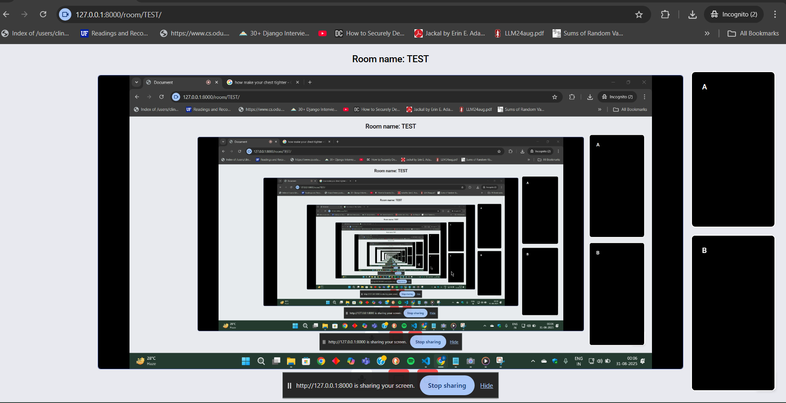
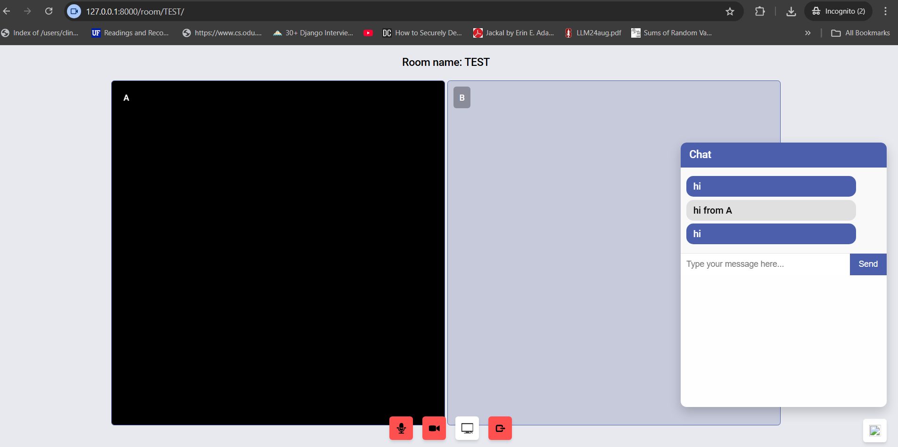

# Wemeet

Here are some sample images:

  
  

Follow these steps to run the application:

```bash
# 1. Install virtualenv (if not already installed)
pip install virtualenv

# 2. Create a virtual environment
virtualenv venv

# 3. Activate the virtual environment
# Windows (cmd)
venv\Scripts\activate
# macOS / Linux
source venv/bin/activate

# 4. Install required packages
pip install -r requirements.txt

# 5. Run the application
daphne -p 8000 videochat.asgi:application

# ( If docker )
docker compose up -d  #run
docker ps             # check current container id
docker stop <container_id>  #stop

# The app will run on port 8000
# Open your browser at http://localhost:8000


